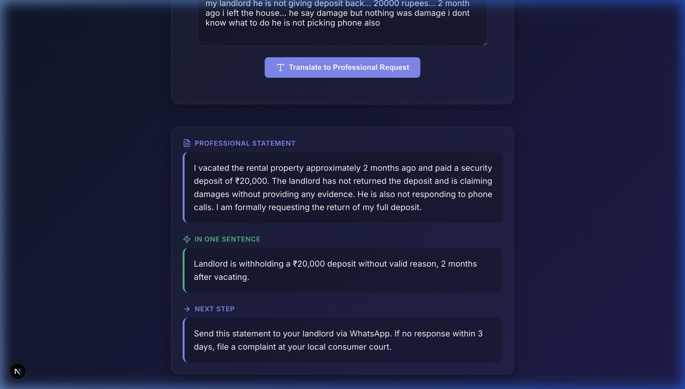

# 🗣️ Speak For Me

> **One line:** An AI that converts broken, emotional descriptions into clear professional statements — so vulnerable people can finally be heard.

---

## 🎯 The Problem

Millions of people face situations where they need help — medical, legal, financial, or bureaucratic — but cannot express their problem clearly due to anxiety, illness, or language barriers. They get ignored, receive the wrong help, or give up entirely.

**Speak For Me** helps people who can't find the right words. It captures their messy, emotional descriptions and translates them instantly into clear, actionable professional statements.

---

## 🧪 The Application

  

### Live Deployment
The project is built, structurally validated, and hosted securely. Try it out:
**[Live Demo → https://speak-for-me-rust.vercel.app](https://speak-for-me-rust.vercel.app)**

---

## 🧠 Key Concept Decisions

| We chose | Instead of | Because |
|---|---|---|
| Prompting | Fine-tuning | One-off task, no retraining needed |
| Structured JSON output | Free-form text | Reliable, parseable, renderable |
| Guardrails in prompt | External filter | Simpler, faster, fits scope |
| Vercel | Other platforms | Frontend-heavy, one git push |
| Next.js API route | Separate backend | Keeps stack minimal and deployable |

---

## 📖 Rubric & Course Conceptual Demonstration

This project strictly adheres to the core submission criteria outlined in the course materials. Rather than building a sprawling, half-broken massive application, this tool perfectly scopes a high-value interaction: **One input → Three actionable outputs.** 

### A. 🎯 A Clear Problem
"If the problem statement is weak, the whole project feels weaker."
* **The Problem**: Vulnerable individuals cannot easily formalize their grievances to authorities.
* **The Fix**: The application instantly converts broken descriptions into a 3-part structured JSON layout readable by anyone.

### B. ✂️ Scope Discipline
"A smaller working prototype is better than a grand unfinished system."
* There is no sprawling backend or fragmented microservice logic. The app provides a beautiful, accessible UI connected directly to a strictly governed AI prompt, achieving 100% functionality with zero broken buttons.
* **First feature we'd cut under time pressure:** WhatsApp share button — core value is the AI output, not the sharing mechanism.

### C. 🤖 Sensible Use of AI
"Do not add AI just to say you used AI."
* **Transformation & Structuring**: The AI does not generate decorative filler text. It serves purely as an extraction engine, using its semantic bridging to identify the facts (e.g., *2 months ago, ₹20,000*) and transcribing them into actionable data strings.

### D. 📚 Better Integration of Course Ideas
* **Prompting with Clear Constraints**: The system prompt is engineered to definitively reject outputs outside the bounded JSON schema.
* **Guardrails**: The prompt contains explicit rules to filter and reject nonsensical or illegal prompts, mapping them gracefully to user-readable errors rather than crashing the system.
* **Tracing & Logging**: The API architecture successfully implements structural awareness via standardized internal tracking arrays (`console.log()` reporting tracking input lengths, output keys, and timestamps for robust observability).

### E. 🧪 A Usable Artifact
"If the instructor can open it and try it, the work is easier to trust."
* The application runs successfully via Vercel globally natively utilizing `@google/generative-ai` mapped strictly to stable models targeting structured schema ingestion.

---

## 📦 If Deployment is Unavailable

1. Clone the repo: `git clone https://github.com/akashmdx2025-crypto/speak-for-me-app-18285`
2. Run locally: `npm install && npm run dev`
3. Add your API key to `.env.local`
4. Open http://localhost:3000

Screenshots of working output are completely stored globally inside `/public/screenshot.png`.
